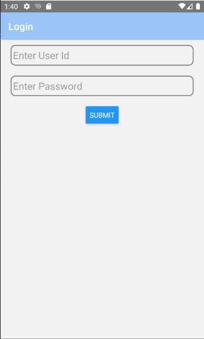
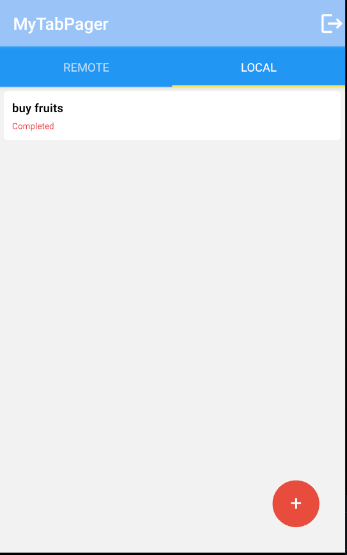

# Citius Tech Android Base Project

# Kotlin MVVM app using clean architecture, Jetpack, Hilt, Retrofit, Moshi, Room, Glide and Coroutines.

## Introduction
This application is a simple base project which has below features points:
- [Code structuring as per clean Architecture](https://proandroiddev.com/kotlin-clean-architecture-1ad42fcd97fa).
- [Using MVVM as development Pattern.](https://developer.android.com/jetpack/guide?gclid=EAIaIQobChMIg9zV-Y2S8gIVvYdLBR2_XQFgEAAYASAAEgJh7vD_BwE&gclsrc=aw.ds).
- [Android Architecture Components (LiveData, ViewModel, Navigation)](https://developer.android.com/guide/navigation?gclid=EAIaIQobChMIs4WrkY6S8gIV_4dLBR1YvgxjEAAYASAAEgJJbPD_BwE&gclsrc=aw.ds).
- [Kotlin features (Lambdas, Constants, Extension functions, and Coroutines)](https://developer.android.com/kotlin?gclid=EAIaIQobChMIs8PXqI6S8gIVBCUrCh1IzQAMEAAYASAAEgKnVfD_BwE&gclsrc=aw.ds).
- [Gradle DSL](https://medium.com/android-dev-hacks/kotlin-dsl-gradle-scripts-in-android-made-easy-b8e2991e2ba)
- [SSL Pinning for network call](https://square.github.io/okhttp/2.x/okhttp/com/squareup/okhttp/CertificatePinner.html)
- [Encrypted Room DataBase](https://medium.com/vmware-end-user-computing/securing-a-room-database-with-passcode-based-encryption-82ec670961e)
- [Encrypted SharedPrefrences](https://developer.android.com/reference/androidx/security/crypto/EncryptedSharedPreferences)
- [Linter](https://developer.android.com/studio/write/lint)
- [Localization for language change(Hindi/English).](https://www.raywenderlich.com/4878024-android-localization-getting-started)

## App Overview
 The app features a two screen navigation

- First Screen which shows basic UI with Six Buttom view, two EditText and three text veiw to show fetchdata.
  1. Update button is used for updating local data which is stored in Room DB for its entered id and its new Value.
  2. Delete button is used for deleting data from Room DB based on id entered.
  3. Load Data is used to load data from serever and store it in Room DB.
  4. Fetech data from local is used to get data from Room DB. It will only load single data.
  5. Nav button is used for navigation.
  6. Lang Button is used changing the language of the app.
  

- Second screen has two button. one will navigate to home and another one for notification.
  1. Back Button is for navigating back to home screen.
  2. Show notification is used to show dumm notificaiton, which is triggered mannly on button click.

  

***Navigation between the screens has been done using the Jetpack Navigation library and the following is its nav graph:***

## Libraries The App uses libraries and tools used to build Modern Android application, mainly part of Android Jetpack
- [Kotlin](https://kotlinlang.org/)
- [Coroutines Flow API](https://kotlinlang.org/docs/reference/coroutines/flow.html)
- [Android Architecture Components](https://developer.android.com/topic/libraries/architecture)
- [Android desugaring for Java 8+ APIs](https://developer.android.com/studio/write/java8-support#library-desugaring)
- [Retrofit](https://square.github.io/retrofit/)
- [Moshi](https://github.com/square/moshi)
- [Glide]( https://github.com/bumptech/glide)
- [Hilt](https://dagger.dev/hilt/) for dependency injection
- [Android KTX](https://developer.android.com/kotlin/ktx) features
- [Robolectric]( http://robolectric.org/androidx_test/) for unit testing

### Scope for Improvements
 The app can be further improved with the addition of the following features
- jetpack Compose for Ui development.
